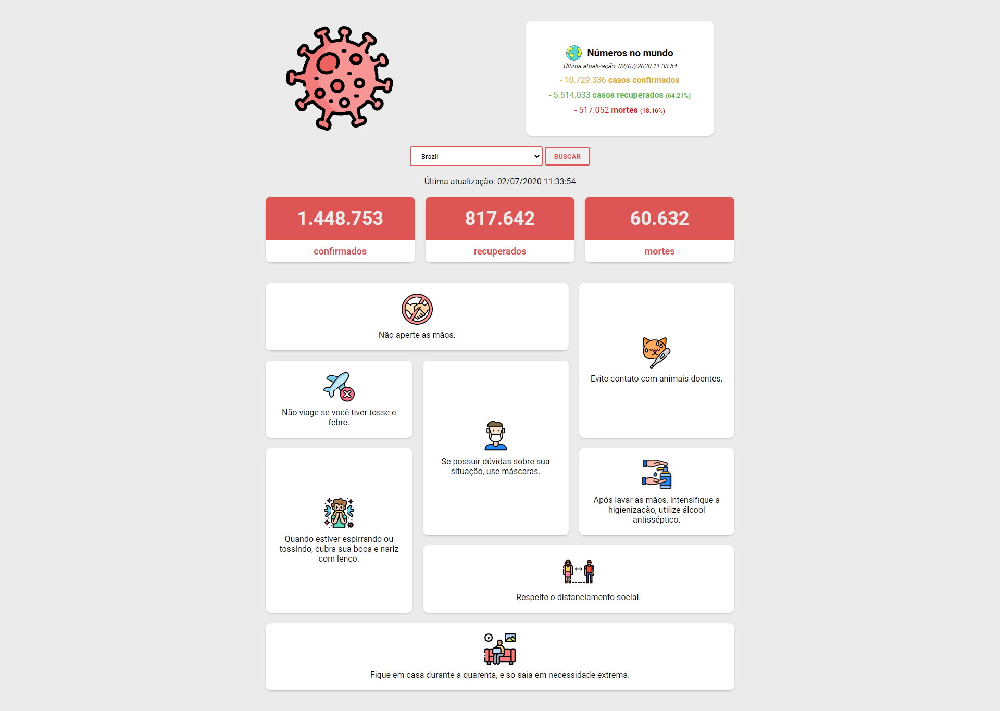
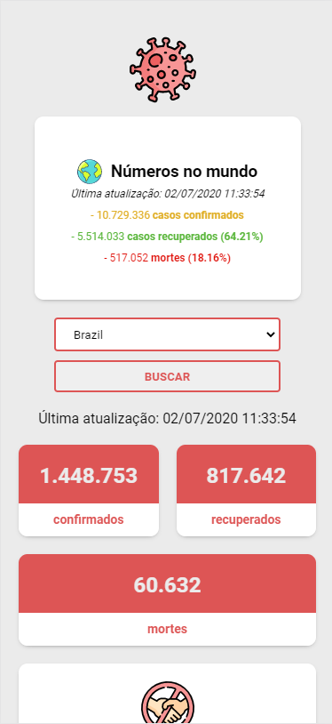

# COVID-19 💉
**Projeto de exibição dos dados de casos confirmados, recuperados e mortes pelo covid-19**    

<strong>DESKTOP</strong>

------------------------------------------

<strong>MOBILE</strong>

------------------------------------------

:construction_worker: Instalação | :rocket: Execução  

Faça um clone desse repositório rodando:  

        git clone https://github.com/maiconboer/covid19.git 

Entre na pasta rodando pelo terminal: **cd covid19**    
Rode **npm install** para instalar as dependências do projeto  
Rode **npm start** para iniciar o servidor de desenvolvimento.  

------------------------------------------
**Dependencias utilizadas:**     

    express  
    node-fetch  
    nunjucks  

